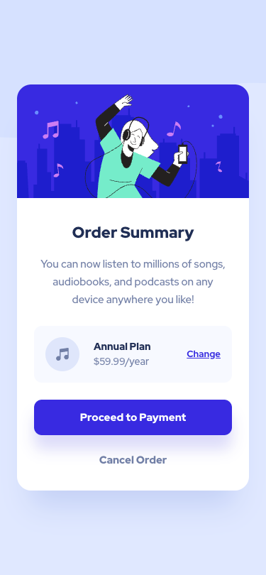

# Frontend Mentor - Order Summary Card Solution

This is a solution to the [Order summary card challenge on Frontend Mentor](https://www.frontendmentor.io/challenges/order-summary-component-QlPmajDUj).

## Table of contents

- [Overview](#overview)
  - [The challenge](#the-challenge)
  - [Screenshot](#screenshot)
  - [Links](#links)
  - [Built with](#built-with)
- [Author](#author)

## Overview

### The challenge

Users should be able to:

- See hover states for interactive elements

## Screenshot

|                  Desktop                   |
| :----------------------------------------: |
|  |

|                  Mobile                   |
| :---------------------------------------: |
|  |

## Links

- Solution URL: [Solution](https://www.frontendmentor.io/solutions/order-summary-component-solution-GTfnwRPgOt)
- Live Site URL: [Live Site](https://ardaeker-order-summary-card-solution.vercel.app)

## Built with

- Semantic HTML5 markup
- Mobile-first workflow
- [Next.js](https://nextjs.org/) - React framework
- [Tailwind CSS](https://tailwindcss.com) - For styles

## Author

- Website - [www.ardaeker.com](https://ardaeker.com)
- Frontend Mentor - [@ardaeker](https://www.frontendmentor.io/profile/ardaeker)
